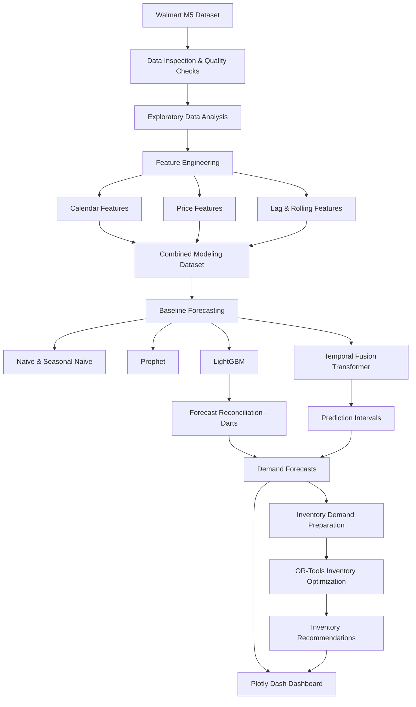

# System Architecture

This diagram illustrates the complete workflow of the Nationwide Demand Forecasting and Inventory Optimization.

```mermaid
flowchart TD
    A["Walmart M5 Dataset"] --> B["Data Inspection & Quality Checks"]
    B --> C["Exploratory Data Analysis"]
    C --> D["Feature Engineering"]

    D --> E["Calendar Features"]
    D --> F["Price Features"]
    D --> G["Lag & Rolling Features"]

    E --> H["Combined Modeling Dataset"]
    F --> H
    G --> H

    H --> I["Baseline Forecasting"]

    I --> J["Naive & Seasonal Naive"]
    I --> K["Prophet"]
    I --> L["LightGBM"]
    I --> M["Temporal Fusion Transformer"]

    L --> N["Forecast Reconciliation - Darts"]
    M --> O["Prediction Intervals"]

    N --> P["Demand Forecasts"]
    O --> P

    P --> Q["Inventory Demand Preparation"]
    Q --> R["OR-Tools Inventory Optimization"]
    R --> S["Inventory Recommendations"]

    P --> T["Plotly Dash Dashboard"]
    S --> T
```
